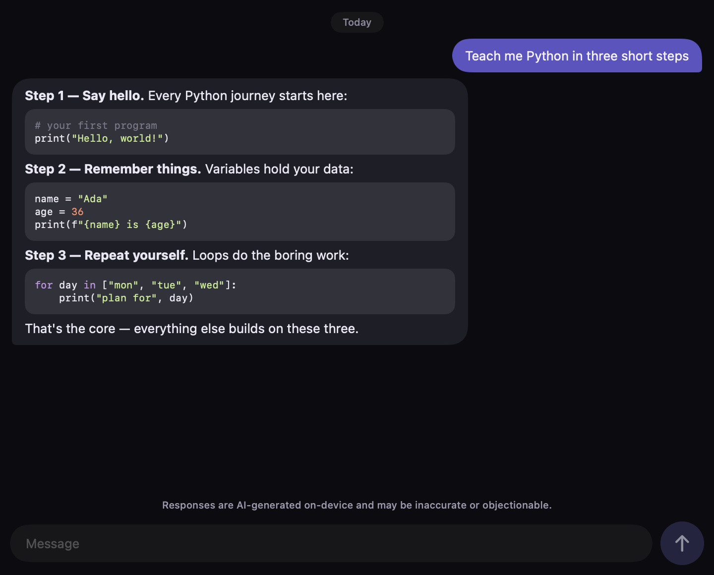

<p align="center">
  
</p>

<h1 align="center">Quenderin</h1>

<p align="center"><strong>An AI that runs on your device — and can run it for you.</strong></p>
<p align="center">Private on-device chat, and a local computer-use agent — a governed, private alternative to cloud agents like Cowork.</p>

<p align="center">
  <a href="https://quenderin.org">quenderin.org</a> ·
  <a href="https://quenderin.org/download.html">download</a> ·
  <a href="https://quenderin.org/roadmap.html">roadmap</a> ·
  <a href="https://quenderin.org/reality.html">the real numbers</a> ·
  <a href="docs/README.md">docs</a> ·
  <a href="LICENSE">MIT</a>
</p>

---

Quenderin downloads an open model (0.4–4.7 GB, your pick) and runs **every token locally**
via [llama.cpp](https://github.com/ggml-org/llama.cpp). After the one-time download there
are zero network calls: no account, no API keys, no telemetry, nothing you type leaves the
device. We've measured ~15 tok/s on an iPhone 12 and ~157–177 tok/s on an M-series Mac —
quick enough to be useful, and the app is honest about the rest (our lightest model ships
graded **Quality: Low**, in the UI, on purpose).

<p align="center">
  
</p>

## What's inside

- **Chat** with streaming replies, Markdown + syntax highlighting, per-conversation
  appearance settings, and a transcript that follows generation (and stops following the
  moment you scroll up).
- **A model library** — Llama, Qwen, DeepSeek-R1, Mistral, Gemma, Phi — with live
  fits-your-RAM badges, one-tap "download the complete library" for big disks, and
  drag-a-GGUF-in import.
- **A task router** that suggests the best *installed* model for each new chat (code →
  the coder model, reasoning → the reasoning model) — a one-tap suggestion, never a
  silent switch.
- **A local computer-use agent** — on a Mac, `quenderin do "<goal>"` organizes files, drives
  any app (via accessibility), and runs your Apple Shortcuts, all governed by a trust loop a
  cloud agent can't match: it asks before every change, keeps a reviewable per-task log
  (`quenderin history`), can undo a whole task even in a new session (`quenderin undo`), and
  previews without touching anything (`--dry-run`) — plus a hard safety blocklist it can't
  override (never autonomously pay, delete, transfer, or touch credentials). [Why local beats
  the cloud here](https://quenderin.org/why-local-agent.html).
- **Guardrails that respect you**: repetition-loop detection, split-character-safe
  streaming (Cyrillic and emoji arrive intact), honest empty-reply notices, and a
  [public ledger of every failure mode we know about](docs/KNOWN_FAILURE_MODES.md).

## The apps

| Platform | Where | Status |
|---|---|---|
| **macOS** | `apple/` (SwiftUI — `QuenderinKit` + `QuenderinApp`) | The most complete client: rail navigation, model library, router, agent, deep settings |
| **iOS** | the same shared `QuenderinKit` | Builds from the same code; on-device inference via the llama.cpp xcframework |
| **Android** | `android/` (Compose + shared Kotlin core) | Core logic at parity (machine-enforced); UI catching up |
| **Windows / Linux** | `src/` + `ui/` (Electron + node-llama-cpp) | **Downloadable preview** — installers built in public by CI: [quenderin.org/download](https://quenderin.org/download.html). Strategy: [docs/WINDOWS_LINUX_STRATEGY.md](docs/WINDOWS_LINUX_STRATEGY.md) |
| **Desktop prototype** | same codebase | The research testbed additionally explores an autonomous device-driver agent that is deliberately **never** shipped in the store apps — see [docs/PRODUCT.md](docs/PRODUCT.md) |

Cross-platform logic (model catalog, agent parser, router, safety blocklist) is hand-ported
Swift ↔ Kotlin and **machine-enforced against drift**: shared canonical vectors + CI checks
(`scripts/check_*_parity.py`) fail the build if one platform tests a case the other doesn't.

## The CLI

For programmers: chat with a local model without leaving the terminal, and pipe anything
into it — same catalog, same SHA-256-verified downloads, zero network calls after setup.

```bash
npm install && npm run build:tsc && npm link   # once; then `quenderin` is on your PATH

quenderin chat                      # interactive REPL (slash commands: /model /models /clear)
quenderin models                    # what's installed / downloadable
quenderin download llama32-1b       # fetch a model
git diff | quenderin chat -p "review this change"    # pipe mode: one answer, plain stdout
```

And on a Mac, the **computer-use agent** — every change asks first, and nothing leaves the machine:

```bash
quenderin capabilities                                  # everything it can do, by tier
quenderin do "organize this" --workspace ~/Downloads    # governed file tasks (undoable)
quenderin do "reply to the top email" --gui             # click/type in any app via accessibility
quenderin do "..." --dry-run                            # rehearse: show what it would do, change nothing
quenderin history                                       # a per-task audit log of what it did
quenderin undo                                          # reverse the last task — even in a new session
```

## Getting started

**macOS / iOS** — requires Xcode:

```bash
cd apple/QuenderinApp
xcodegen                      # brew install xcodegen (generates Quenderin.xcodeproj)
open Quenderin.xcodeproj      # run "QuenderinMac" or "Quenderin" (iOS)
```

Real inference needs the llama.cpp xcframework once — see
[apple/QuenderinKit/INTEGRATION.md](apple/QuenderinKit/INTEGRATION.md). Without it the app
still builds and runs against a mock engine.

**Android** — open `android/` in Android Studio; the pure-JVM core self-verifies via
`android/quenderin-core` (see [docs/BUILD_MOBILE.md](docs/BUILD_MOBILE.md)).

**Desktop prototype:**

```bash
npm install
npm run dashboard        # React dashboard at http://localhost:3000
npm run electron:dev     # or as a desktop app
```

## Show your homework

We publish the material most projects keep private — that's the point:

- [REALITY.md](apple/REALITY.md) — can phones actually run this? Measured, sourced, caveated.
- [On-device LLM research](docs/research/on-device-llm.md) — 28 sources, adversarially verified; the refuted claims are listed too.
- [Similar projects](docs/research/similar-projects.md) — who else does this well, and what we took from each.
- [The bug journal](docs/BUG_JOURNAL.md) — every bug, its cause, its lesson.
- [Known failure modes](docs/KNOWN_FAILURE_MODES.md) — everything we know can go wrong: fixed, planned, or accepted, each with a reason.
- [The brand guide](docs/BRAND.md) — why the whole design derives from the artwork, and the anti-slop rules.

Full documentation map: [docs/README.md](docs/README.md) · architecture:
[docs/ARCHITECTURE.md](docs/ARCHITECTURE.md) · mobile stack:
[apple/ARCHITECTURE.md](apple/ARCHITECTURE.md)

## Contributing

PRs welcome — see [CONTRIBUTING.md](CONTRIBUTING.md).

## License

[MIT](LICENSE). The elf artwork and the Quenderin name identify this project — please
don't use them to mark derived works as official.
